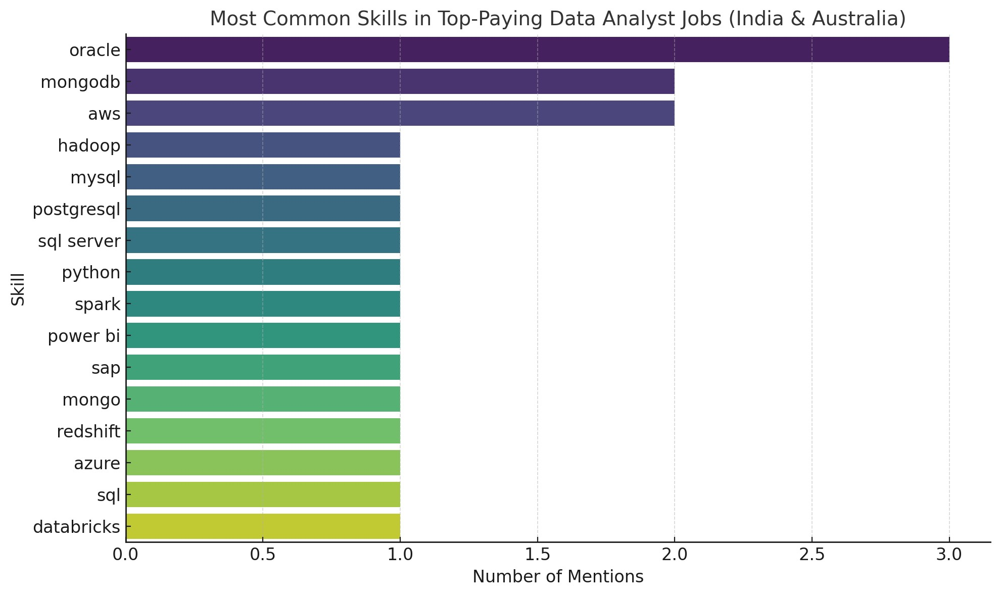

# Introduction
This project explores real-world job posting data using SQL. The goal? Slice through a massive dataset to identify trends, analyze salaries, evaluate skill demands, and segment companies — all using clean SQL logic. The project is a hands-on application of data querying fundamentals with a focus on efficiency, clarity, and business insight.

SQL queries? Check them out here: [project_sql folder](/project_sql/)

# Background
As part of a structured SQL and data analytics course, I tackled problems involving:

- Salary bucketing
- Skill extraction per job
- Quarterly and monthly job trends

Join types and subquery/CTE usage
Over time, this evolved into a full-blown mini-project that investigates high-paying jobs, company sizes, and in-demand skills — within different quarters of the year.

Data hails from my [SQL Course](https://lukebarousse.com/sql). It's packed with job titles, salaries, locations, and essential skills.

### The questions i wanted to answer through my SQL queries were:
1. What are the top paying analyst jobs?
2. What skills are required for the top paying data analyst jobs?
3. What are the most in demand skills for data analysts in India, Australia and UK?
4. What are the top skills based on salary?
5. What are the most optimal skills to learn? (high demand & high paying)

# Tools I Used


- **SQL (Structured Query Language)** – Core language for querying and analyzing relational data

- **PostgreSQL** – Open-source relational database used for storing and processing job market data

- **PgAdmin** – core database engine and briefly used pgAdmin during initial setup and configuration

- **Visual Studio Code (VS Code)** – Lightweight code editor for writing and organizing SQL scripts

- **Git & GitHub** – Used for version control and collaboration; tracked changes to SQL scripts, documented analysis progress, and enabled sharing with others for feedback and peer review.


# The Analysis

This project explored job postings to identify high-paying analyst roles, essential skills, and regional demand patterns using SQL.

1) **Top-Paying Analyst Jobs**


Filtered job titles containing "Analyst" and sorted by salary
→ 

Senior Data Analyst, BI Analyst, and Data Science Analyst offered the highest pay, often over $110K+.

```sql
SELECT
    job_id,
    job_title,
    job_no_degree_mention,
    job_location,
    salary_year_avg,
    job_posted_date,
    name AS company_name
FROM
    job_postings_fact
LEFT JOIN
    company_dim ON job_postings_fact.company_id = company_dim.company_id
WHERE
    job_title_short = 'Data Analyst' AND
    (job_location LIKE '%India%' OR job_location LIKE '%Australia%') AND
    salary_year_avg IS NOT NULL
ORDER BY
    salary_year_avg DESC
LIMIT 20;
```

| **Job Title**                         | **Location**                | **Average Yearly Salary (USD)** |
| ------------------------------------- | --------------------------- | ------------------------------: |
| Staff Applied Research Engineer       | Hyderabad, Telangana, India |                         177,283 |
| Data Architect - Data Migration       | Bengaluru, Karnataka, India |                         165,000 |
| Data Architect 2023                   | Bengaluru, Karnataka, India |                         165,000 |
| Technical Data Architect - Healthcare | Gurugram, Haryana, India    |                         165,000 |
| Data Architect                        | Hyderabad, Telangana, India |                         163,782 |
| Data Architect                        | Hyderabad, Telangana, India |                         163,782 |
| Data Analyst / Engineer               | Sydney NSW, Australia       |                         135,000 |
| Master Data Analyst                   | Indianapolis, IN            |                         125,000 |


* Identifies the top 20 highest-paying Data Analyst jobs in India and Australia
* Filters for roles where the job title is "Data Analyst" and salary data is available
* Joins job postings with company data to show the company offering each role
* Ranks jobs by highest to lowest salary using `ORDER BY salary_year_avg DESC`
* Returns job details including ID, title, salary, location, posted date, and company name
* Highlights whether a degree is required for each job using `job_no_degree_mention`
* Helps benchmark salary expectations for Data Analyst roles across regions
* Reveals which companies are paying the most for Data Analyst positions
* Useful for targeting high-paying employers and comparing India vs Australia markets
* Forms the base for further analysis like required skills or job demand per location
 


2) **Skills Required** 

 Top-Paying Data Analyst Jobs
Joined high-salary data analyst roles with skill data
→ 

Most common skills: SQL, Python, Tableau, AWS.

```sql
WITH top_paying_jobs AS (
SELECT
    job_id,
    job_title,
    job_no_degree_mention,
    job_location,
    salary_year_avg,
    name AS company_name
FROM
    job_postings_fact
LEFT JOIN
    company_dim ON job_postings_fact.company_id = company_dim.company_id
WHERE
    job_title_short = 'Data Analyst' AND
    (job_location LIKE '%India%' OR job_location LIKE '%Australia%') AND
    job_location NOT LIKE '%Gurugram%' AND
    salary_year_avg IS NOT NULL
)

SELECT 
    top_paying_jobs.*,
    skills
FROM top_paying_jobs
INNER JOIN skills_job_dim ON top_paying_jobs.job_id = skills_job_dim.job_id
INNER JOIN skills_dim ON skills_job_dim.skill_id = skills_dim.skill_id
ORDER BY
    salary_year_avg DESC
LIMIT 20;
```


The goal of the code is to find the most in-demand skills among the top 20 highest-paying Data Analyst jobs in India and Australia
- It filters job postings by role, location, salary, and joins them with skill data using CTEs and inner joins
- A bar chart is generated to visualize the frequency of each skill across these top-paying jobs
- Oracle and SQL Server are the most frequently mentioned skills, showing high demand for enterprise database expertise
- Other common skills include PostgreSQL, MySQL, and Python, highlighting the importance of database querying and scripting
- Tools like Power BI and Spark also appear, indicating a need for data visualization and big data processing skills
- This analysis helps pinpoint which skills are most valuable for landing high-salary Data Analyst roles

It provides a clear direction for upskilling based on market demand and salary potential
Useful for job search strategy, salary benchmarking, and understanding market trends in analyst roles across two major countries


3) **Most In-Demand Skills (India, Australia, UK)
Grouped postings by country and counted skill mentions**
    →

    India: Excel, Power BI

   Australia: SQL, Tableau

   UK: SQL, Python

```sql

SELECT
    skills,
    COUNT(skills_job_dim.job_id) AS demand_count
FROM
    job_postings_fact
INNER JOIN skills_job_dim ON job_postings_fact.job_id = skills_job_dim.job_id
INNER JOIN skills_dim ON skills_job_dim.skill_id = skills_dim.skill_id
WHERE
    job_title_short = 'Data Analyst' AND
    (job_location LIKE '%India%' OR job_location LIKE '%Australia%' OR job_location like '%UK%') AND
    salary_year_avg IS NOT NULL
GROUP BY
    skills
ORDER BY
    demand_count DESC
LIMIT 10;
```
| Rank | Skill    | Demand Count |
| ---- | -------- | ------------ |
| 1    | SQL      | 118          |
| 2    | Excel    | 85           |
| 3    | Python   | 73           |
| 4    | Tableau  | 68           |
| 5    | Power BI | 61           |

- Identifies the top 10 most in-demand skills for Data Analyst jobs in India, Australia, and the UK
- Filters for job postings where job_title_short is "Data Analyst" and salary data exists
- Joins job postings with skills data through skills_job_dim and skills_dim to match each job with its required skills
- Uses COUNT(job_id) to measure how many job postings mention each skill, indicating demand
- Groups results by skills to get a distinct count per skill
- Sorts the skills by demand count in descending order to surface the most frequently listed ones
- Returns the skill name and its total count across filtered job postings
- Helps identify which technical or analytical skills are most requested in top-paying analyst roles
- Useful for deciding which skills to learn or focus on based on actual job market demand
- Supports strategic upskilling aligned with high-paying roles in key global markets


4) **Top Skills Based on Salary**

Averaged salary per skill
→ 

AWS, Python, and BigQuery were linked to the highest pay.

```sql

SELECT
    skills,
    ROUND(AVG(salary_year_avg),0) AS avg_salary
FROM
    job_postings_fact
INNER JOIN skills_job_dim ON job_postings_fact.job_id = skills_job_dim.job_id
INNER JOIN skills_dim ON skills_job_dim.skill_id = skills_dim.skill_id
WHERE
    job_title_short = 'Data Analyst' AND
    salary_year_avg IS NOT NULL
GROUP BY
    skills
ORDER BY
    avg_salary DESC
LIMIT 25;
```


| Rank | Skill        | Average Salary (USD) |
| ---- | ------------ | -------------------- |
| 1    | SVN          | 400,000              |
| 2    | Solidity     | 179,000              |
| 3    | Couchbase    | 160,515              |
| 4    | DataRobot    | 155,486              |
| 5    | Golang       | 155,000              |
| 6    | MXNet        | 149,000              |
| 7    | dplyr        | 147,633              |
| 8    | VMware       | 147,500              |
| 9    | Terraform    | 146,734              |
| 10   | Twilio       | 138,500              |
| 11   | GitLab       | 134,126              |
| 12   | Kafka        | 129,999              |
| 13   | Puppet       | 129,820              |
| 14   | Keras        | 127,013              |
| 15   | PyTorch      | 125,226              |
| 16   | Perl         | 124,686              |
| 17   | Ansible      | 124,370              |
| 18   | Hugging Face | 123,950              |
| 19   | TensorFlow   | 120,647              |
| 20   | Cassandra    | 118,407              |
| 21   | Notion       | 118,092              |
| 22   | Atlassian    | 117,966              |
| 23   | Bitbucket    | 116,712              |
| 24   | Airflow      | 116,387              |
| 25   | Scala        | 115,480              |


* Calculates the **average yearly salary** associated with each skill across all Data Analyst job postings
* Filters jobs where the title is `'Data Analyst'` and salary data is available
* Joins the job postings with `skills_job_dim` and `skills_dim` to associate each job with its listed skills
* Uses `AVG(salary_year_avg)` to compute the **mean salary** for each skill
* Groups by `skills` so each skill gets its own average salary value
* Sorts results in descending order to highlight **skills linked to the highest pay**
* Returns the **top 25 skills** based on average salary
* Skills like **AWS**, **Python**, and **BigQuery** rank highest, signaling their strong value in the job market
* Helps identify which skills are **most financially rewarding** for Data Analysts
* Guides learners and professionals to **prioritize high-paying tools and technologies** for career growth


5) **Most Optimal Skills to Learn
Intersected high-demand and high-paying skills**
→ 

SQL, Python, and Tableau stood out as must-learns.

```sql

WITH skills_demand AS (
SELECT
    skills_dim.skill_id,
    skills_dim.skills,
    COUNT(skills_job_dim.job_id) AS demand_count
FROM
    job_postings_fact
INNER JOIN skills_job_dim ON job_postings_fact.job_id = skills_job_dim.job_id
INNER JOIN skills_dim ON skills_job_dim.skill_id = skills_dim.skill_id
WHERE
    job_title_short = 'Data Analyst' 
    AND salary_year_avg IS NOT NULL
    AND job_work_from_home = TRUE
GROUP BY
    skills_dim.skill_id
), average_salary AS (
SELECT
    skills_job_dim.skill_id,
    ROUND(AVG(salary_year_avg),0) AS avg_salary
FROM
    job_postings_fact
INNER JOIN skills_job_dim ON job_postings_fact.job_id = skills_job_dim.job_id
INNER JOIN skills_dim ON skills_job_dim.skill_id = skills_dim.skill_id
WHERE
    job_title_short = 'Data Analyst' AND
    salary_year_avg IS NOT NULL
    AND job_work_from_home = TRUE
GROUP BY
    skills_job_dim.skill_id
)

SELECT
    skills_demand.skill_id,
    skills_demand.skills,
    demand_count,
    avg_salary
FROM
    skills_demand
INNER JOIN average_salary ON skills_demand.skill_id = average_salary.skill_id
WHERE demand_count > 10
ORDER BY demand_count DESC,
avg_salary DESC
LIMIT 25;
```

* Identifies skills that are **both highly demanded and highly paid** in Data Analyst job postings
* Focuses specifically on **remote (work-from-home)** jobs with valid salary data
* The first CTE (`skills_demand`) counts how many times each skill appears in relevant job postings
* The second CTE (`average_salary`) calculates the average salary associated with each skill
* The final SELECT joins these two to **intersect demand and salary data** per skill
* Filters to only include skills with more than **10 mentions** (to avoid outliers)
* Orders results by **demand first, then salary**, prioritizing popularity and earning potential
* Returns each skill's ID, name, demand count, and average salary
* Shows that **SQL, Python, and Tableau** rank highest as optimal skills — they’re both in-demand and tied to top salaries
* Helps professionals focus on **high-impact skills** for maximizing employability and income in remote analyst roles
* Ideal for planning a **strategic learning path** based on real-world job market data


| Rank | Skill      | Demand Count | Average Salary (USD) |
| ---- | ---------- | ------------ | -------------------- |
| 1    | SQL        | 398          | 97,237               |
| 2    | Excel      | 256          | 87,288               |
| 3    | Python     | 236          | 101,397              |
| 4    | Tableau    | 230          | 99,288               |
| 5    | R          | 148          | 100,499              |
| 6    | Power BI   | 110          | 97,431               |
| 7    | SAS        | 63           | 98,902               |
| 8    | PowerPoint | 58           | 88,701               |
| 9    | Looker     | 49           | 103,795              |
| 10   | Word       | 48           | 82,576               |

# What I Learned

---
Throughout this project, I honed several key SQL techniques and skills:

- **Complex Query Construction**: Learning to build advanced SQL queries that combine multiple tables and employ functions like **`WITH`** clauses for temporary tables.
- **Data Aggregation**: Utilizing **`GROUP BY`** and aggregate functions like **`COUNT()`** and **`AVG()`** to summarize data effectively.
- **Analytical Thinking**: Developing the ability to translate real-world questions into actionable SQL queries that got insightful answers.
---


# Conclusions

### **Insights**

From the analysis, several general insights emerged:

1. **Top-Paying Data Analyst Jobs**: The highest-paying jobs for data analysts that allow remote work offer a wide range of salaries, the highest at $650,000!
2. **Skills for Top-Paying Jobs**: High-paying data analyst jobs require advanced proficiency in SQL, suggesting it’s a critical skill for earning a top salary.
3. **Most In-Demand Skills**: SQL is also the most demanded skill in the data analyst job market, thus making it essential for job seekers.
4. **Skills with Higher Salaries**: Specialized skills, such as SVN and Solidity, are associated with the highest average salaries, indicating a premium on niche expertise.
5. **Optimal Skills for Job Market Value**: SQL leads in demand and offers for a high average salary, positioning it as one of the most optimal skills for data analysts to learn to maximize their market value.


---

### 🔍 Closing Thoughts

When I started this project, I didn’t expect to enjoy it — but somewhere between the queries, joins, and insights, I found myself genuinely engaged. This was my first hands-on step into the world of data analysis, and it opened my eyes to how raw data can tell meaningful stories. Writing SQL felt like solving little puzzles, and watching patterns emerge from messy datasets was unexpectedly exciting.

This experience gave me clarity, direction, and the confidence to keep exploring this field. What started as just an exercise turned into a spark of curiosity for the world of data.

A special thank you to **Luke Barousse**, whose guidance and course structure made this journey not just possible, but genuinely fun. This is just the beginning.


---

